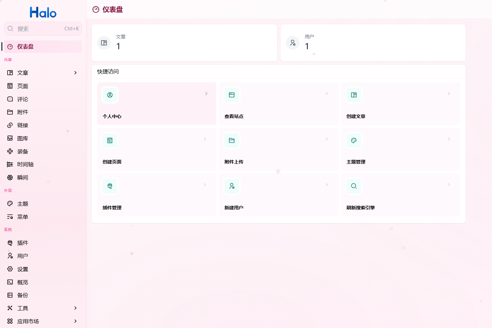

# 后台美化插件

为 Halo 后台管理界面（Console）和网关页面（登录 / 注册 / 密码重置等）提供现代化的视觉美化，支持多种风格一键切换。

## 预览



## 功能特性

### 🎨 6 种 Console 主题风格

| 主题 | 风格 | 说明 |
|------|------|------|
| 🌿 默认 | 薄荷清新 | 清新淡绿色调，柔和渐变背景 |
| 🌊 深邃蓝 | 专业冷静 | 沉稳蓝色系，适合专注工作 |
| 🌙 暗夜 | 深色护眼 | 深色背景 + 紫色点缀，长时间使用不疲劳 |
| 🌸 樱花 | 温暖柔和 | 粉色系暖色调，温馨舒适 |
| ◻️ 极简 | 纯净无饰 | 去除所有装饰效果，回归纯净 |
| 🌌 极光 | 紫粉科技 | 紫粉渐变 + 极光光效，科技感十足 |

另外支持 **🖥️ 跟随系统** 模式，根据操作系统的明暗设置自动在默认和暗夜主题之间切换。

### ✨ 主题专属动态装饰

每个主题都有独特的 Canvas 粒子动画效果：

| 主题 | 动态效果 |
|------|----------|
| 🌸 樱花 | 粉色花瓣从上方缓缓飘落，带旋转和摇摆 |
| 🌙 暗夜 | 紫色星光在背景中随机闪烁 |
| 🌌 极光 | 紫粉色大光晕缓慢漂浮流动 |
| 🌊 深邃蓝 | 半透明蓝色气泡从底部上浮，带高光 |
| 🌿 默认 | 淡绿色光斑缓慢漂浮 |
| ◻️ 极简 | 无效果（符合极简哲学） |

- 使用 `<canvas>` 实现，`pointer-events: none`，不影响任何交互操作
- 尊重 `prefers-reduced-motion` 系统设置，开启减少动画的用户自动跳过
- 可在设置面板中一键关闭

### 🔐 网关页面美化

登录、注册、密码重置等网关页面同样支持 6 种风格切换，包含：

- 渐变背景 + 浮动光球动画
- 毛玻璃卡片效果（`backdrop-filter: blur + saturate`）
- 表单输入框美化 + 验证状态动画（错误抖动、成功高亮）
- 提交按钮悬浮阴影
- 社交登录按钮 pill 样式
- 响应式光球尺寸（移动端自适应）
- 主题专属粒子效果

提供独立开关，关闭后不注入任何网关样式，避免与前台主题自带的登录页样式冲突。

### 🎯 覆盖的 UI 组件

插件对以下 Console 组件进行了主题化美化：

- Sidebar（侧边栏 + 底部主题装饰）
- Card（卡片 + 悬浮效果）
- Button（按钮 + 阴影 + 悬浮动画）
- Entity List（列表项 + 选中态）
- Modal（弹窗 + 缩放进入动画）
- Dropdown（下拉菜单 + 淡入动画）
- Toast（通知 + 右侧滑入动画）
- Tabs（标签页 + active 状态）
- Form Input（输入框 + focus 光环）
- FormKit（表单标签 + 帮助文字）
- Table（斑马纹 + hover 行高亮）
- Tooltip（提示框）
- Checkbox / Radio（选中态主题色）
- Code block / Pre（代码块主题化）
- Avatar（头像 hover 放大）
- Editor（ProseMirror 编辑器 + 工具栏）
- Scrollbar（自定义滚动条 + Firefox 支持）
- Pagination、Description List、Alert、Tag 等

### ♿ 无障碍支持

- 所有按钮和输入框支持 `:focus-visible` 键盘焦点样式
- 禁用态元素有明确的视觉反馈（`opacity` + `cursor: not-allowed`）
- 尊重 `prefers-reduced-motion` 减少动画偏好

### 🔧 自定义 CSS

设置面板提供 CSS 输入框，高级用户可以输入自定义 CSS 代码追加到 Console 页面中，实现个性化定制。

## 安装方式

1. 从 [Releases](https://github.com/pandyzhou/plugin-ui-beautify/releases) 下载最新的 `plugin-ui-beautify-x.x.x.jar`
2. 进入 Halo 后台 → 插件 → 右上角「安装」→ 上传 jar 文件
3. 启用插件后，在插件设置页面选择喜欢的风格

## 设置项

| 设置项 | 类型 | 默认值 | 说明 |
|--------|------|--------|------|
| Console 风格 | 下拉选择 | 默认 | 选择后台界面的视觉风格 |
| 启用动态装饰 | 开关 | 开启 | 控制主题专属粒子动画效果 |
| 启用网关页面美化 | 开关 | 开启 | 关闭可避免与前台主题冲突 |
| 网关页面风格 | 下拉选择 | 默认 | 登录/注册等页面的视觉风格 |
| 自定义 CSS | 文本框 | 空 | 追加自定义 CSS 到 Console |

## 兼容性

- Halo >= 2.22.0
- Java 21
- 所有现代浏览器（Chrome、Firefox、Edge、Safari）

## 开发

```bash
# 克隆仓库
git clone https://github.com/pandyzhou/plugin-ui-beautify.git
cd plugin-ui-beautify

# 构建
./gradlew clean build -x check

# 产物在 build/libs/ 目录下
```

## 许可证

[MIT](LICENSE)
